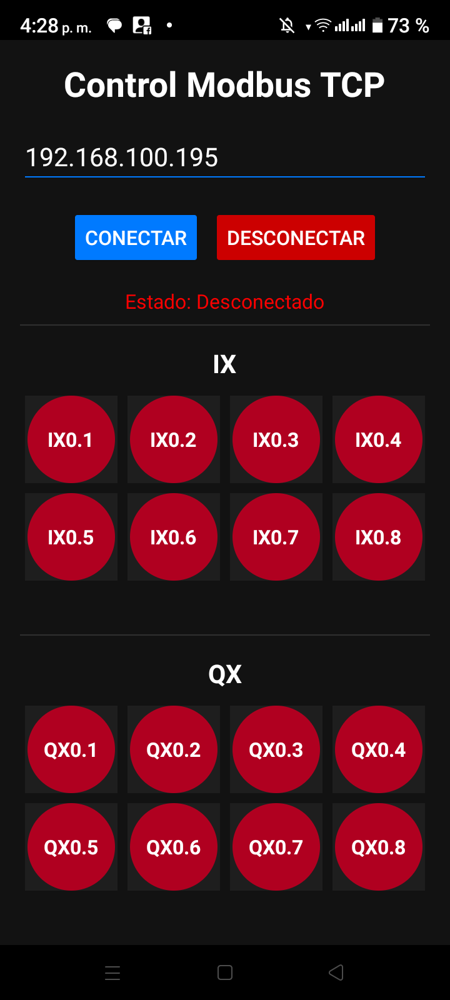

# Documentación Técnica: Aplicación Android ModbusOpenPLC
**Estudiante: Armin Daniel Antonio Mendieta** 

Este documento proporciona una visión técnica de la aplicación Android ModbusOpenPLC, detallando su arquitectura, la implementación de la comunicación Modbus, los componentes de la interfaz de usuario y las configuraciones clave.

## 1. Resumen del Proyecto

La aplicación ModbusOpenPLC es un cliente Android diseñado para comunicarse con un servidor OpenPLC utilizando el protocolo Modbus TCP. Su propósito principal es permitir a los usuarios controlar y monitorear entradas discretas (IX) y bobinas (QX) en el PLC conectado.

## 2. Arquitectura

La aplicación sigue una arquitectura Android estándar, utilizando principalmente una `AppCompatActivity` (`MainActivity`) para la interfaz de usuario y una clase dedicada (`ClienteModbusTcp`) para manejar la comunicación Modbus TCP. Se utiliza un `RecyclerView.Adapter` personalizado (`ModbusValueAdapter`) para mostrar eficientemente los valores Modbus.

### Componentes Clave:

*   **`MainActivity.kt`**: El punto de entrada principal y el controlador de la interfaz de usuario de la aplicación. Gestiona las interacciones del usuario, inicia la comunicación Modbus, procesa las respuestas y actualiza la interfaz de usuario.
*   **`ClienteModbusTcp.kt`**: Encapsula la lógica del cliente Modbus TCP, incluyendo la gestión de sockets, la serialización de solicitudes, la deserialización de respuestas y el manejo de errores específicos del protocolo Modbus.
*   **`ModbusValueAdapter.kt`**: Un adaptador personalizado para `RecyclerView` que muestra los valores individuales de las entradas discretas (IX) y bobinas (QX) de Modbus. Maneja la representación visual y la interacción del usuario para las bobinas (alternando su estado).

## 3. Comunicación Modbus

### 3.1. Protocolo

La aplicación se comunica utilizando **Modbus TCP**. Esto implica establecer una conexión de socket TCP/IP con el PLC e intercambiar Unidades de Datos de Aplicación (ADU) de Modbus a través de esta conexión.

### 3.2. Implementación del Cliente (`ClienteModbusTcp.kt`)

*   **Gestión de Conexiones**:
    *   `conectar()`: Establece una conexión TCP con la dirección IP y el puerto especificados. Incluye tiempos de espera de conexión y lectura (5 segundos).
    *   `desconectar()`: Cierra el socket TCP y los flujos de entrada/salida asociados.
*   **Manejo de Solicitudes/Respuestas**:
    *   `enviarSolicitud(solicitud: ByteArray)`: Envía una ADU de solicitud Modbus y lee la ADU de respuesta correspondiente del socket.
    *   `parsearRespuestaModbus(respuesta: ByteArray)`: Analiza la respuesta de la matriz de bytes sin procesar en una clase de datos estructurada `RespuestaModbus`, validando el encabezado Modbus TCP (ID de Transacción, ID de Protocolo, Longitud, ID de Unidad) y verificando las respuestas de excepción de Modbus.
*   **Sincronización (`Mutex`)**:
    *   Para evitar condiciones de carrera y asegurar que solo una transacción de solicitud/respuesta Modbus esté en curso en un momento dado, se utiliza un `kotlinx.coroutines.sync.Mutex` dentro del método `enviarSolicitud`. Esto es crucial para mantener la integridad de los datos y prevenir problemas de sincronización del protocolo, especialmente con tasas de sondeo rápidas.
*   **Manejo de Errores**:
    *   `ExcepcionModbus`: Una clase de excepción personalizada para errores específicos de Modbus (por ejemplo, códigos de función de excepción devueltos por el PLC).
    *   `IOException`: Se maneja para problemas relacionados con la red (fallos de conexión, errores de lectura/escritura, cierres inesperados de conexión).

### 3.3. Funciones Modbus Utilizadas

La aplicación actualmente soporta los siguientes códigos de función Modbus:

*   **Leer Entradas Discretas (Código de Función 0x02)**: Se utiliza para leer el estado de las entradas discretas (IX).
    *   `crearSolicitudLecturaEntradasDiscretas(idUnidad: Byte, direccionInicio: Short, cantidad: Short)`
*   **Leer Bobinas (Código de Función 0x01)**: Se utiliza para leer el estado de las bobinas (QX).
    *   `crearSolicitudLecturaBobinas(idUnidad: Byte, direccionInicio: Short, cantidad: Short)`
*   **Escribir Bobina Única (Código de Función 0x05)**: Se utiliza para escribir un único valor booleano en una bobina (QX).
    *   `crearSolicitudEscrituraBobinaUnica(idUnidad: Byte, direccion: Short, valor: Boolean)`

### 3.4. Direccionamiento

La aplicación utiliza **direccionamiento basado en 0** al construir las solicitudes PDU de Modbus. Por ejemplo, `IX0.0` corresponde a la dirección Modbus `0`, `IX0.1` a la dirección `1`, y así sucesivamente.

### 3.5. Tasa de Sondeo

La aplicación lee periódicamente el estado de las entradas discretas y las bobinas del PLC. La tasa de sondeo actual se establece en **250 milisegundos (1/4 de segundo)**.

## 4. Interfaz de Usuario (UI)

La interfaz de usuario se define en `app/src/main/res/layout/activity_main.xml` y es gestionada por `MainActivity.kt`.

### 4.1. Estructura del Layout

El layout principal es un `LinearLayout` con orientación vertical, que contiene:

*   **`EditText` (`ipAddressEditText`)**: Para introducir la dirección IP del PLC.
*   **`Button` (`connectButton`, `disconnectButton`)**: Para establecer y terminar la conexión Modbus.
*   **`TextView` (`connectionStatusTextView`, `errorTextView`)**: Muestra el estado de la conexión y los mensajes de error.
*   **`RecyclerView` (`discreteInputsRecyclerView`, `coilsRecyclerView`)**: Muestra los valores de las entradas discretas y bobinas de Modbus, respectivamente. Ambos utilizan un `GridLayoutManager` para una visualización en cuadrícula.

### 4.2. Adaptador Personalizado (`ModbusValueAdapter.kt`)

*   Muestra cada valor Modbus (IX o QX) con su nombre (por ejemplo, "IX0.0", "QX0.1") y su estado actual (ENCENDIDO/APAGADO representado por color).
*   Para las bobinas, proporciona un elemento interactivo para alternar su estado, lo que activa una operación de escritura en el PLC.
*   **Mapeo de Direcciones**: El adaptador ahora incluye una función `addressMapping`. Esto permite que el adaptador muestre una lista filtrada de elementos mientras asocia correctamente cada elemento mostrado con su dirección Modbus original. Esto es crucial cuando ciertas direcciones se ocultan intencionalmente de la interfaz de usuario.

### 4.3. Filtrado y Elementos Ocultos

Para proporcionar una interfaz más limpia o para centrarse en puntos de E/S específicos, ciertas direcciones Modbus se ocultan intencionalmente de la interfaz de usuario:

*   **Entradas Discretas (IX)**: `IX0.0`, `IX0.4`, `IX0.5` no se muestran.
*   **Bobinas (QX)**: `QX0.4` no se muestra.

La comunicación Modbus subyacente sigue leyendo/escribiendo en estas direcciones; simplemente se filtran antes de presentarse en el `RecyclerView`.

### 4.4. Fondo

El fondo de la aplicación presenta un **degradado similar a Gemini**. Esto se implementa utilizando un recurso drawable (`gemini_background.xml`) que define un degradado lineal de un azul oscuro (`geminiGradientStart`) a un púrpura oscuro (`geminiGradientEnd`).

## 5. Librerías/Dependencias

*   **Kotlin Coroutines**: Se utiliza ampliamente para gestionar operaciones asíncronas (comunicación de red, lecturas periódicas) de manera estructurada y no bloqueante.
*   **AndroidX LifecycleScope**: Proporciona un `CoroutineScope` vinculado al ciclo de vida de la `Activity`, asegurando que las corrutinas se cancelen automáticamente cuando la actividad se destruye.
*   **E/S Estándar de Java**: Se utiliza para la comunicación de sockets de bajo nivel (por ejemplo, `java.net.Socket`, `java.io.InputStream`, `java.io.OutputStream`).
*   **Componentes de UI de Android**: Widgets estándar de Android y `RecyclerView` de AndroidX para construir la interfaz de usuario.

## 6. Configuración

*   **Dirección IP Predeterminada**: `192.168.100.195` (configurable a través de `ipPorDefecto` en `MainActivity.kt`).
*   **Puerto Modbus TCP**: `502` (configurable a través de `puertoModbus` en `MainActivity.kt`).
*   **ID de Unidad Modbus**: `7` (configurable a través de `idUnidad` en `MainActivity.kt`).
*   **Dirección IP Guardada**: La última dirección IP utilizada con éxito se guarda utilizando `SharedPreferences` de Android (`PREFS_NAME`, `PREF_IP_ADDRESS`) y se carga automáticamente cuando se inicia la aplicación.

## 7. Manejo de Errores y Resiliencia

*   **Fallos de Conexión**: Se manejan durante el proceso `conectar()`, mostrando un mensaje de error al usuario.
*   **Errores del Protocolo Modbus**: Las respuestas se analizan en busca de encabezados Modbus TCP no válidos (por ejemplo, ID de Protocolo incorrecto) o códigos de excepción Modbus.
*   **Errores de Lectura/Escritura de Socket**: Los `IOException` durante las operaciones de socket se capturan y se informan.
*   **Resiliencia**:
    *   El `Mutex` en `ClienteModbusTcp` evita que las transacciones Modbus concurrentes corrompan el flujo de comunicación.
    *   El bucle de lectura periódica en `MainActivity` ya no desconecta automáticamente al cliente en caso de errores de comunicación. En su lugar, los errores se informan a la interfaz de usuario y el bucle continúa intentando leer. Esto permite una mayor resiliencia contra problemas de red transitorios, requiriendo una reconexión manual solo si la conexión se pierde permanentemente.

## 8. Mejoras Futuras

*   **Reconexión Automática**: Implementar lógica para intentar la reconexión automáticamente después de una pérdida de conexión, posiblemente con una estrategia de retroceso.
*   **Parámetros Modbus Configurables**: Permitir a los usuarios configurar el puerto Modbus y el ID de unidad directamente desde la interfaz de usuario.
*   **Soporte para Otras Funciones Modbus**: Ampliar la funcionalidad para incluir la lectura/escritura de registros de retención (HR) y registros de entrada (IR).
*   **Retroalimentación Mejorada de la UI**: Proporcionar una retroalimentación visual más detallada sobre el estado de los puntos de E/S Modbus individuales (por ejemplo, parpadeo al actualizar, estados de error más claros).
*   **Servicio en Segundo Plano**: Implementar la comunicación Modbus en un servicio en segundo plano para permitir la monitorización incluso cuando la aplicación no está en primer plano.
*   **Pruebas Unitarias**: Agregar pruebas unitarias exhaustivas para la lógica de comunicación Modbus y los componentes de la interfaz de usuario.
*   **Configuración de Usuario**: Una pantalla de configuración dedicada para todos los parámetros configurables.

---
## Nota sobre la implementación de Modbus

Esta aplicación **no utiliza ninguna librería externa específica para Modbus**. La comunicación Modbus TCP está implementada manualmente dentro del proyecto, principalmente en la clase `ClienteModbusTcp.kt`. Se emplean las clases estándar de Java (`Socket`, `InputStream`, `OutputStream`) junto con Kotlin Coroutines para la gestión de operaciones asíncronas, pero toda la lógica de construcción y análisis de mensajes Modbus TCP se desarrolla directamente en el propio código fuente de la aplicación, sin recurrir a paquetes de terceros o frameworks externos de Modbus.

